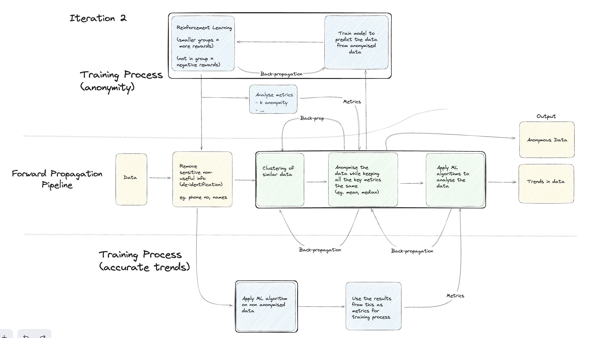

Here in this training process, including anonymized and non-anonymized data, can be repeated for further refinement.
Training Process (Anonymity):
1.	Forward Propagation: Data is initially fed into the model.
2.	Reinforcement Learning: The model learns through trial and error interactions, receiving rewards and penalties.
3.	Cluster/Grouping similar data points: Similar data points are grouped to protect privacy.
4.	Negative Events: Unwanted outcomes are penalized during reinforcement learning.
5.	Backpropagation: Model parameters adjust based on feedback, improving performance.
6.	Output: Final predictions or decisions made by the trained model.

Training Process (Accurate Trends):
1.	Apply ML Algorithm: A suitable algorithm is applied to the data.
2.	Metrics: Performance is evaluated using metrics like accuracy, precision, and recall.
3.	Analyze Metrics: Metrics are examined to identify areas for improvement.
4.	Backpropagation: Model parameters refine based on metric analysis.

Data: here it refers to the dataset used for model training.

Model Training:
Here for model training we use two types of data.
1.	Non-anonymized Data: Original data without privacy modifications, initially used for model training.
2.	Anonymized Data: Modified data, preserving privacy, used to evaluate model performance and identify biases.

GAN Training Process
•	Generator tries to generate anonymous data that resembles the original data.
•	Discriminator tries to classify the data as either real (original) or fake (generated).
•	Output: This refers to the final classification results from the Discriminator.

Forward Propagation
•	Data: This refers to the input data, which can be the original data or the generated data.
•	Anonymity Pipeline: This stage processes the data to ensure anonymity, potentially using techniques like differential privacy or generative models.
•	Generator: The anonymized data is fed into the Generator, which attempts to create new, realistic data that preserves the key characteristics of the original data but doesn't contain any identifying information.
•	Discriminator: Both the original data and the generated data are fed into the Discriminator. The Discriminator's goal is to accurately distinguish between the two types of data.

Backpropagation
•	Discriminator: Based on the Discriminator's output , the Generator and Anonymity Pipeline are adjusted to improve their performance.
•	Generator: The Generator aims to produce even more realistic data that can fool the Discriminator.
•	Anonymity Pipeline: The Anonymity Pipeline is fine-tuned to ensure anonymity while still providing enough information for the Generator to create useful data.
