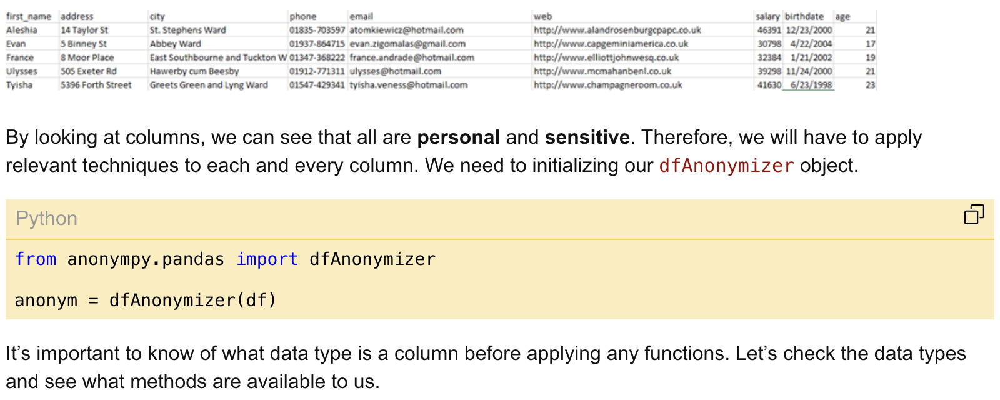
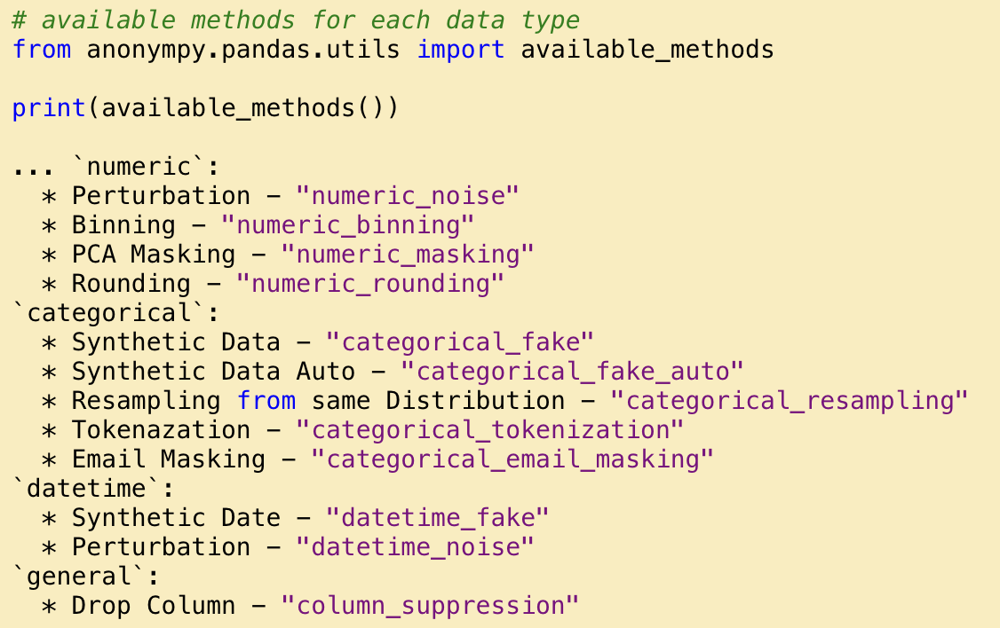

please edit this

## Uses ML

---

## Doesn't use ML

### Datanonymizer

-   to anonymise csv files
-   [fgmacedo/datanonymizer: Anonymizer tool for datasets such CSV files (github.com)](https://github.com/fgmacedo/datanonymizer)

### Anonympy - Data Anonymisation with Python

-   library for data anonymisation in python
-   [ArtLabss/open-data-anonymizer (github.com)](https://github.com/ArtLabss/open-data-anonymizer)
-   [anonympy - Data Anonymization with Python - CodeProject](https://www.codeproject.com/Articles/5324569/anonympy-Data-Anonymization-with-Python)

### Tools-for-Health-Data-Anonymization - microsoft

[microsoft/Tools-for-Health-Data-Anonymization: Set of tools for helping with data (in FHIR format) anonymization. (github.com)](https://github.com/microsoft/Tools-for-Health-Data-Anonymization)

Tool to anonymize **DICOM or FHIR** data. Techniques - not provided (probably doesn't use ML)

---

## Different Concepts

Techniques to anonymise users ie. de-identification

De-identification tools

-   [Microsoft Presidio](https://microsoft.github.io/presidio/)

---
